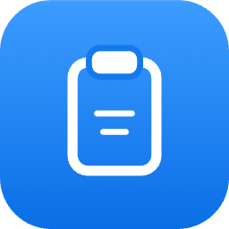
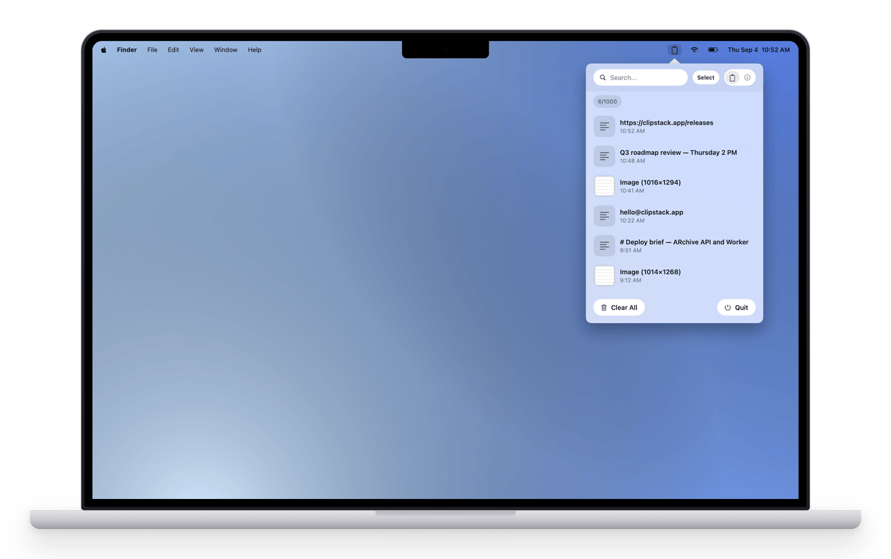
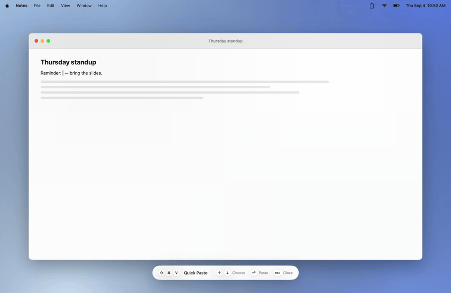
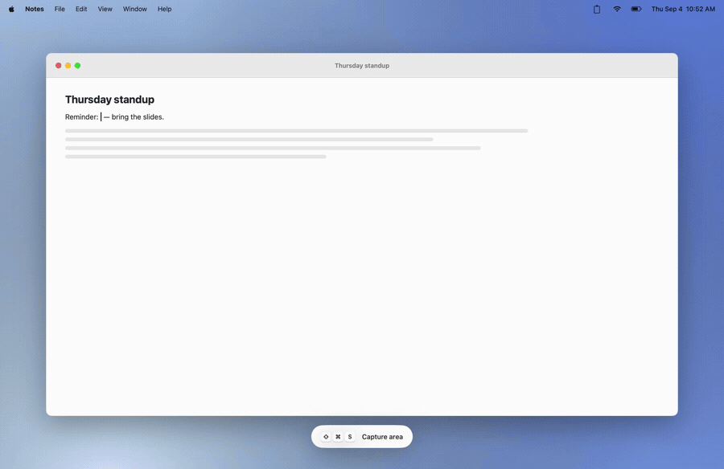
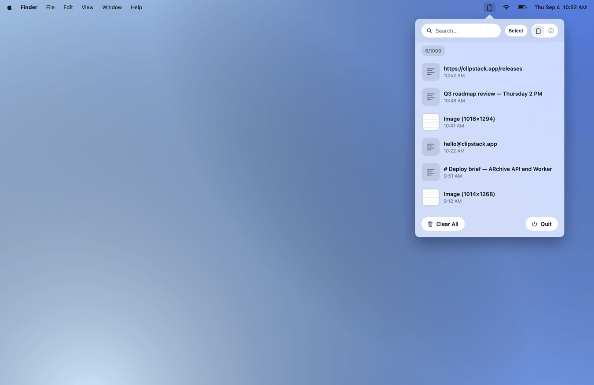

<div align="center">



# ClipStack

**A free, local-only clipboard manager for the macOS menu bar.**

Every copy you make, one shortcut away — and nothing ever leaves your Mac.

[](https://github.com/noasantos/copy-stack/releases)
[](#install)
[](#privacy)
[](LICENSE)

<picture>
  <source media="(prefers-color-scheme: dark)" srcset="docs/media/hero-dark.png">
  
</picture>

</div>

## Install

```bash
curl -fsSL https://raw.githubusercontent.com/noasantos/copy-stack/main/install.sh | bash
```

Requirements: macOS 13 (Ventura) or later. Apple Silicon and Intel supported.

Pass a version only when you want a specific release instead of latest:

```bash
curl -fsSL https://raw.githubusercontent.com/noasantos/copy-stack/main/install.sh | bash -s -- 0.1.0
```

Supported release versions remain installable by passing the version explicitly. Current supported versions are `0.1.0`, `0.1.1`, `0.2.0`, `0.2.1`, `0.3.0`, `0.4.0`, `0.4.1`, and `0.4.2`.

## How it works

**Quick Paste** — `Shift + Command + V` opens your history right at the text cursor, in any app. Arrow keys choose, `Return` pastes.

<picture>
  <source media="(prefers-color-scheme: dark)" srcset="docs/media/quick-paste-dark.gif">
  
</picture>

**Area capture** — `Shift + Command + S` grabs a region of the screen straight into the history. No file to hunt for afterwards.

<picture>
  <source media="(prefers-color-scheme: dark)" srcset="docs/media/area-capture-dark.gif">
  
</picture>

**The menu bar** — the full history, text and images together, searchable and draggable.

<picture>
  <source media="(prefers-color-scheme: dark)" srcset="docs/media/history-popover-dark.png">
  
</picture>

## Update

Run the installer again. It removes the previous app bundle and installs the latest release.

```bash
curl -fsSL https://raw.githubusercontent.com/noasantos/copy-stack/main/install.sh | bash
```

## What it does

- Monitors clipboard for text and images
- Auto-copies screenshots
- Captures a selected screen area instantly with `Shift + Command + S`
- Opens clipboard history beside the active text cursor with `Shift + Command + V`
- Supports selecting, copying, and dragging multiple clipboard items
- Shows recent top-level Downloads files in an ephemeral tray with multi-item drag
- Stores local clipboard history
- Restore any previous clipboard item from the menu bar
- No network access. No cloud sync. No account. No telemetry.

The quick-paste panel asks for macOS Accessibility access the first time it needs to locate another app's text cursor and paste the selected item. It opens only when an editable text field is focused and exposes its insertion caret; it does nothing over non-editable content. The panel closes as soon as you click, scroll, type, switch apps or Spaces, or otherwise move away from the caret. Because ClipStack is ad-hoc signed, macOS can require Accessibility to be turned off and on once after an app update.

## Privacy

ClipStack stores clipboard history exclusively in:

```text
~/Library/Application Support/ClipStack/
```

No data leaves your machine. No analytics. No crash reporting. History is stored unencrypted in this release (MVP). Do not store sensitive secrets in clipboard history if this concerns you.

The Downloads tray stores no history and does not copy files into ClipStack storage. It only keeps recent file references in memory for the current app session.

## Uninstall

```bash
curl -fsSL https://raw.githubusercontent.com/noasantos/copy-stack/main/uninstall.sh | bash
```

Or manually:

```bash
rm -rf /Applications/ClipStack.app
rm -rf ~/Library/Application\ Support/ClipStack
rm -f ~/Library/Preferences/com.clipstack.app.plist
```

## Security note

ClipStack is not signed with an Apple Developer ID certificate. Release archives contain an ad-hoc signed app; the installer verifies and preserves that signature after removing the macOS quarantine flag. Review install.sh before running it if you have concerns.

## Build from source

Requires Xcode 15+ and macOS 13+.

```bash
git clone https://github.com/noasantos/copy-stack
cd copy-stack
xcodebuild -scheme ClipStack -configuration Release \
  ONLY_ACTIVE_ARCH=NO ARCHS="arm64 x86_64" build
```

## License

MIT
